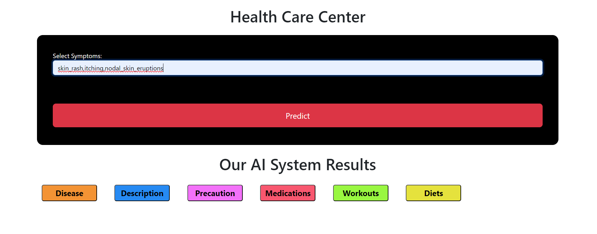
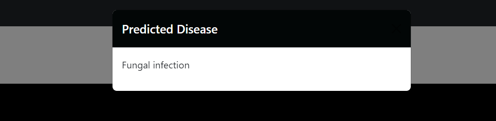

# Disease Prediction and Recommendation System

This Flask application provides a symptom-based disease prediction system using a machine learning model. Users can input symptoms, and the app predicts a likely disease, along with relevant information including a description, precautions, medications, diet recommendations, and workouts. The model uses a pre-trained Support Vector Classifier (SVC).

## Table of Contents
- [Project Overview](#project-overview)
- [Features](#features)
- [Datasets](#datasets)
- [Installation](#installation)
- [Usage](#usage)
- [API Routes](#api-routes)
- [Screenshots](#screenshots)
- [Future Enhancements](#future-enhancements)
- [Acknowledgement](#acknowledgments)
- [Contributors](#contributors)
- [License](#license)

## Project Overview

This project helps users to predict diseases based on symptoms inputted through the UI. Along with disease prediction, it provides additional recommendations for precautions, medications, dietary adjustments, and workout plans based on the predicted disease.

## Features

- **Disease Prediction:** Enter symptoms, and the app returns the predicted disease.
- **Recommendations:** Provides information on disease description, precautions, medications, diet, and workout routines.
- **User-Friendly Interface:** A simple, interactive UI built with HTML and Flask.
- **Extendable:** Easy to add new diseases, symptoms, or additional data sources.
  
## Datasets

- `symptoms_df.csv`: Contains symptoms data for model input.
- `precautions_df.csv`: Holds precautionary measures for various diseases.
- `workout_df.csv`: Contains workout recommendations for specific diseases.
- `description.csv`: Provides descriptions for each disease.
- `medications.csv`: Lists medications for different diseases.
- `diets.csv`: Contains dietary recommendations for diseases.

## Project Structure
```
project-directory/
|-- datasets/
|   |-- symptoms_df.csv
|   |-- precautions_df.csv
|   |-- medications.csv
|   |-- diets.csv
|   |-- description.csv
|   `-- workout_df.csv
|-- models/
|   `-- svc.pkl
|-- app.py         # Flask application
|-- model.py       # Model training script
|-- templates/
|   |-- index.html
|   |-- about.html
|   |-- contact.html
|   `-- developer.html
|-- static/        # Static assets (CSS, JS, images)
`-- README.md
```

### Prerequisites
- Python 3.8+
- Apache Spark
- Flask
- Required Python libraries:
  ```bash
  pip install flask pyspark pandas numpy
  ```
  
## Installation

1. **Clone the Repository**
    ```bash
    git clone [https://github.com/your-username/disease-prediction-system.git](https://github.com/Jonam-2004/Disease-Prediction-and-Health-Recommendation.git)
    cd disease-prediction-system
    ```

2. **Install the Required Packages**
    ```bash
    pip install -r requirements.txt
    ```

3. **Prepare the Model and Datasets**
   - Place your trained `svc.pkl` model inside the `models/` directory.
   - Ensure all datasets are in the `datasets/` folder as specified in the code.
   - To create the model run the model.py file in the dataset folder.

4. **Run the Application**
    ```bash
    python app.py
    ```

## Usage

1. Start the Flask server by running `python app.py`.
2. Navigate to `http://127.0.0.1:5000/` in your web browser.
3. Enter your symptoms (comma-separated) on the homepage to receive a disease prediction.
4. Review the disease description, precautions, recommended medications, diet, and workout.

## API Routes

- **Home (`/`)**: The main page where users can input symptoms for disease prediction.
- **Predict (`/predict`)**: Handles POST requests to process symptoms and display predictions.


## Screenshots

### Home Page


### Prediction Results


## Future Enhancements

- **Integration with More Models**: Allow for selecting different machine learning models.
- **Extended Symptoms and Disease Data**: Expand the database to include more diseases and symptoms.
- **User Authentication**: Add login features for personalized user tracking.
- **Recommendation System**: Use collaborative filtering to enhance diet, medication, and workout suggestions.

## Acknowledgments
We express our gratitude to the management, faculty, and staff of **Mepco Schlenk Engineering College**, Sivakasi, for their continuous support and guidance.

## Contributors
- **[Abhishek S](https://github.com/Abishek9342)**
- **[Manoj S](https://github.com/Jonam-2004)**
- **[Prasanna Venkatesh S](https://github.com/anna123venkat)**


## License

This project is licensed under the MIT License. See the [LICENSE](LICENSE) file for details.
